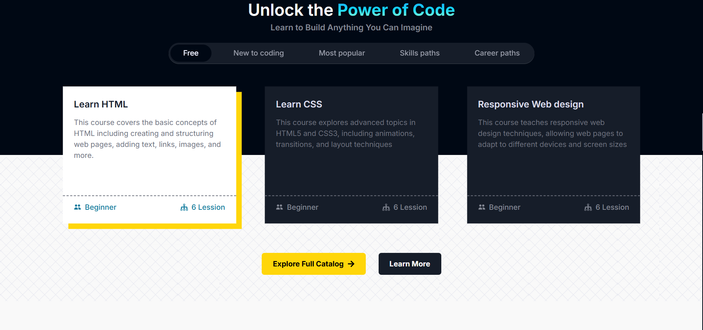
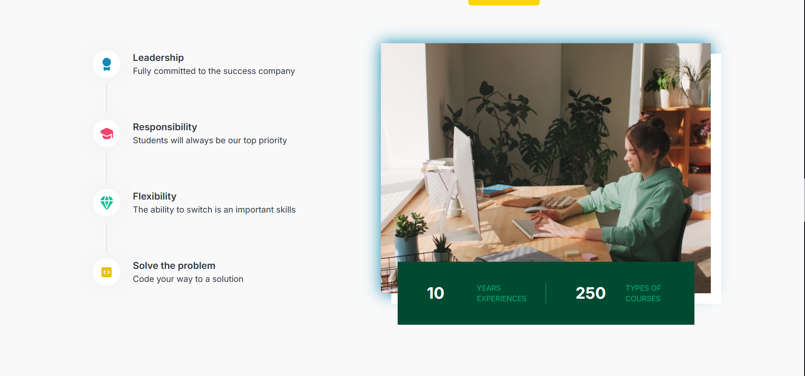
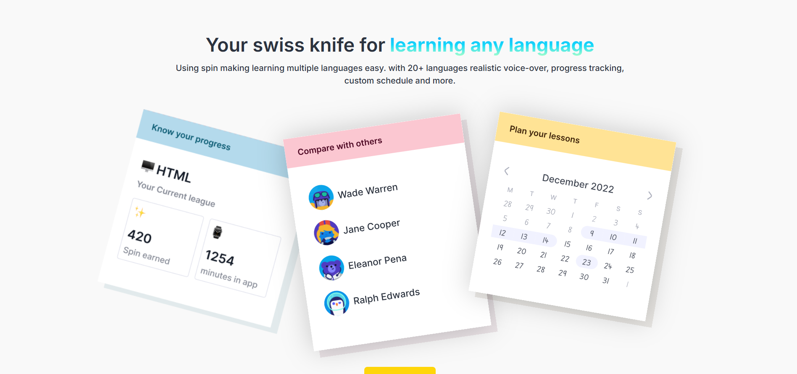

# 📘 Shikshashii – A Modern Space for Learning Growth

Shikshashii is a modern Learning Management System (LMS) designed to provide a clean, interactive, and user-friendly digital learning experience for students and educators.


## 🌟 Features

- 🎓 Modern and responsive user interface  
- 📚 Course-based learning platform  
- 🧑‍🏫 Student and instructor support  
- 🔐 Secure authentication system  
- ⚡ Smooth navigation and performance  

---

## 🛠️ Tech Stack

- **Frontend:** HTML, CSS, JavaScript  
- **Framework:** React.js  
- **Styling:** CSS  
- **Deployment:** Vercel  
- **Version Control:** Git & GitHub  

---

## 📸 Project Screenshots

### 🏠 Homepage


### 🏠 Home Section


### 🏠 Home UI


### ℹ️ About Us Page


### 📞 Contact Page


### 🎨 UI Preview


---

## 🚀 How to Run Locally

1. Clone the repository
```bash
git clone https://github.com/007Ayushi/Shikshashii-A-modern-space-for-learning-growth.git
